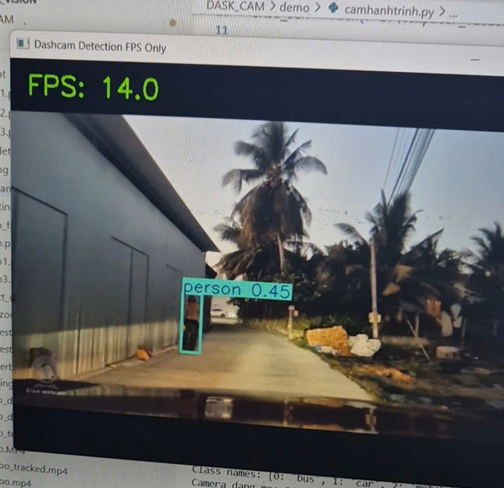
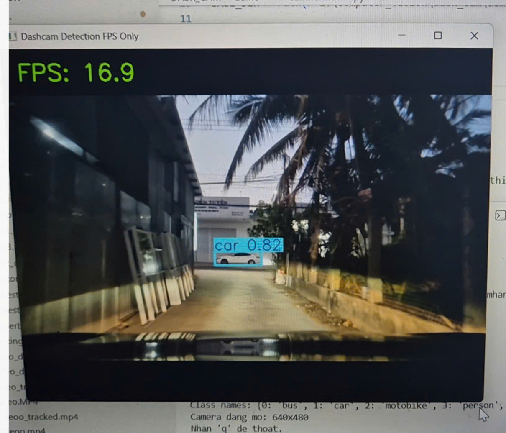

# YOLO26 Dashcam Detection

Real-time object detection demo for dashcam and webcam streams using Python, OpenCV, and Ultralytics YOLO.

This project demonstrates a practical computer vision pipeline that loads a trained YOLO model, captures frames from a live camera, performs real-time inference, draws detection results on each frame, and overlays FPS for performance monitoring.

## Overview

This repository was built as a compact deployment-style demo rather than a notebook experiment. The focus is on running a trained detection model on a live video source and presenting results in a form that is easy to evaluate in a portfolio or CV review.

## Key Highlights

- Built a real-time object detection application for webcam or dashcam input
- Integrated Ultralytics YOLO inference with OpenCV video capture and visualization
- Displayed live bounding boxes, class predictions, and FPS on streaming frames
- Structured the project as a lightweight runnable demo suitable for portfolio presentation

## Demo

### Screenshots





### Video

[Watch demo on YouTube](https://youtube.com/shorts/jnz_Q4mqbDE)

## Tech Stack

- Python
- OpenCV
- Ultralytics YOLO
- PyTorch model weights (`.pt`)

## What The Application Does

The script in [camhanhtrinh.py](e:\Computer_Vision\DASK_CAM\demo1\camhanhtrinh.py:1) performs the following steps:

- resolves the model path from the current project directory
- loads the trained YOLO model from `supbest.pt`
- opens a camera stream with OpenCV
- runs inference on each incoming frame
- draws detection boxes and labels on the output frame
- computes and displays FPS in real time
- exits cleanly when the user presses `q`

## Project Structure

```text
demo1/
|- assets/
|  \- demo/
|     |- demo-1.jpg
|     |- demo-2.jpg
|     \- .gitkeep
|- camhanhtrinh.py
|- supbest.pt
|- README.md
|- .gitignore
```

## How To Run

### 1. Install dependencies

```bash
pip install ultralytics opencv-python
```

If your environment does not already include PyTorch, install the correct version first for your CPU or CUDA setup.

### 2. Prepare the model

Place the trained model file in the project root:

```text
supbest.pt
```

### 3. Run the demo

```bash
python camhanhtrinh.py
```

## Configuration

You can adjust these values directly in [camhanhtrinh.py](e:\Computer_Vision\DASK_CAM\demo1\camhanhtrinh.py:1):

- `MODEL_PATH`: path to the YOLO model file
- `CAMERA_INDEX`: camera source index, commonly `0` or `1`
- `CONF_THRESHOLD`: detection confidence threshold
- `IMGSZ`: inference image size
- `FLIP_FRAME`: enable if the camera feed is mirrored

## Practical Notes

- Press `q` to stop the application.
- If the camera does not open, try changing `CAMERA_INDEX`.
- On Windows, `cv2.CAP_DSHOW` can help if camera startup is unstable.
- The current script is designed for live camera inference, not batch offline evaluation.

## CV-Ready Project Summary

You can describe this project on your CV with wording like:

> Built a real-time object detection demo using Python, OpenCV, and Ultralytics YOLO, enabling live camera inference with annotated bounding boxes and FPS monitoring for practical computer vision deployment.

Shorter version:

> Developed a real-time YOLO-based dashcam detection demo with live visualization and performance monitoring.

## Suggested Improvements

To make this repository stronger for future interviews, the next upgrades should be:

- support input from video files in addition to webcams
- save annotated output video
- add command-line arguments for runtime configuration
- report latency, FPS, and detection counts more explicitly
- export the model to ONNX for lightweight deployment
- document detected classes and test environment

## Author

**Le Thanh Hai**

- GitHub: [ThanhHaipear](https://github.com/ThanhHaipear)
